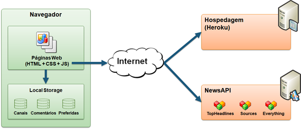

# Arquitetura da Solução

Pré-requisitos: <a href="3-Projeto de Interface.md"> Projeto de Interface</a>

A arquitetura para a solução Gestão de condomínios será baseada na infraestrutura web, levando em 
consideração o maior nível de segurança que a tecnologia atual poderá prover. Desde modo, nossa 
aplicação será executada nos navegadores modernos, ou seja, com suporte nativo ao [Vanilla Ecma Script 
6](https://bit.ly/2SNSUDM) ou superior (com isto não iremos dar suporte ao Internet Explorer, uma vez 
que a desenvolvedora, Microsoft Corporation, [descontinuou](https://bit.ly/3eQMZqf) o produto, 
consequentemente não provendo atualizações de segurança).

Uma vez definida a infraestrutura principal (web), para que o sistema rode nativamente nos navegadores, 
iremos utilizar o [HTML](https://bit.ly/3hyRA22) (HyperText Marckup Language) para mostrar o conteúdo ao
usuário, [CSS](https://bit.ly/3wafl4y) (Cascading Style Sheet) para estilizar o conteúdo da página, 
entretanto, faremos uso de um pré-compilador de CSS, o [SCSS](https://bit.ly/3tVMPC2) (Sassy Cascading 
Style Sheet), que irá melhorar a performance no desenvolvimento e por fim o Vanilla Javascript (ES6+) 
para adicionar maior dinamismo às ações do usuário.

Neste primeiro momento iremos persistir os dados em arquivos no formato padrão 
[JSON](https://bit.ly/2SSfqLP). A medida que o projeto for evoluindo, algumas alterações na 
persistência poderá sofer alguma alteração para um SGBD (Sistema de Gerenciamento de Banco de Dados) 
SQL (preferencialmente) ou NoSQL.

E o principal recurso a ser utilizado será a hospedagem da aplicação, definida neste primeiro momento, na 
plataforma do [Heroku](https://bit.ly/33PBGs1), uma vez que irá nos possibilitar a utilização da 
[plataforma Cloud](https://bit.ly/33QxNDm) sem custos adicionais, permitindo uma análise de viabilidade 
de expansão de maneira simples e eficiente, ao passo que a plataforma possui os recursos necessários 
para o desenvolvimento de aplicações simples e complexas.

A solução Gestão de condomínios tem a previsão de utilização de diversas APIs, entretanto, nesta primeira 
fase do projeto, estará excluída ao passo que será preciso uma [MVP](https://bit.ly/2Rp1HMe) (Minimum 
Viable Product - Produto Viável Mínimo em português)

## Diagrama de componentes

Diagrama que permite a modelagem física de um sistema, através da visão dos seus componentes e relacionamentos entre os mesmos.

Exemplo: 

Os componentes que fazem parte da solução são apresentados na Figura XX.

Figura XX - Arquitetura da Solução

A solução implementada conta com os seguintes módulos:
- **Navegador** - Interface básica do sistema  
  - **Páginas Web** - Conjunto de arquivos HTML, CSS, JavaScript e imagens que implementam as funcionalidades do sistema.
   - **Local Storage** - armazenamento mantido no Navegador, onde são implementados bancos de dados baseados em JSON. São eles: 
     - **Canais** - seções de notícias apresentadas 
     - **Comentários** - registro de opiniões dos usuários sobre as notícias
     - **Preferidas** - lista de notícias mantidas para leitura e acesso posterior
 - **News API** - plataforma que permite o acesso às notícias exibidas no site.
 - **Hospedagem** - local na Internet onde as páginas são mantidas e acessadas pelo navegador. 

> **Links Úteis**:
>
> - [Whimsical](https://whimsical.com/)

Inclua um diagrama da solução e descreva os módulos e as tecnologias que fazem parte da solução. Discorra sobre o diagrama.

A imagem a seguir ilustra a o fluxo do usuário em nossa solução. Assim
que o usuário entra na plataforma, ele é apresentado à tela inicial
(Tela 1) onde ele é confrontado com as opões de editar seu perfil ou
então visualizar sua galeria.

Caso ele opte por seguir pelo primeiro caminho (Editar Perfil), ele é
redirecionado para a tela de edição de perfil (Tela 2), onde pode
atualizar seus dados cadastrais. Nessa tela, o usuário também pode
escolher para editar sua foto de perfil. Ao selecionar essa opção, ele é
redirecionado para a Tela 3, onde ele a imagem expandida do perfil do
usuário é mostrado. Ao selecionar a opção para atualizar a imagem, uma
nova janela abre pedindo para o usuário fazer o upload da nova foto.
Assim que o processo termina um pop-up exibe o status para o usuário
(Tela 4) e o usuário é redirecionado para a Tela 2.

Caso o usuário opte seguir pelo segundo caminho (Visualizar Galeria) ele
é redirecionado para a Tela 5 com todas as fotos que o usuário possui. O
usuário pode clicar em um post qualquer para visualizar os detalhes do
post (Tela 6). Nessa tela, ele pode então escolher editar o post, sendo
redirecionado para a Tela 7. Ao editar as informações, o usuário pode
escolher salvar ou deletar o post. Em ambos os casos o status é
notificado para o usuário (Tela 8) e em seguida ele é redirecionado
para a Tela 2.

## Tecnologias Utilizadas

Descreva aqui qual(is) tecnologias você vai usar para resolver o seu problema, ou seja, implementar a sua solução. Liste todas as tecnologias envolvidas, linguagens a serem utilizadas, serviços web, frameworks, bibliotecas, IDEs de desenvolvimento, e ferramentas.

Apresente também uma figura explicando como as tecnologias estão relacionadas ou como uma interação do usuário com o sistema vai ser conduzida, por onde ela passa até retornar uma resposta ao usuário.

## Hospedagem

Explique como a hospedagem e o lançamento da plataforma foi feita.

> **Links Úteis**:
>
> - [Website com GitHub Pages](https://pages.github.com/)
> - [Programação colaborativa com Repl.it](https://repl.it/)
> - [Getting Started with Heroku](https://devcenter.heroku.com/start)
> - [Publicando Seu Site No Heroku](http://pythonclub.com.br/publicando-seu-hello-world-no-heroku.html)
